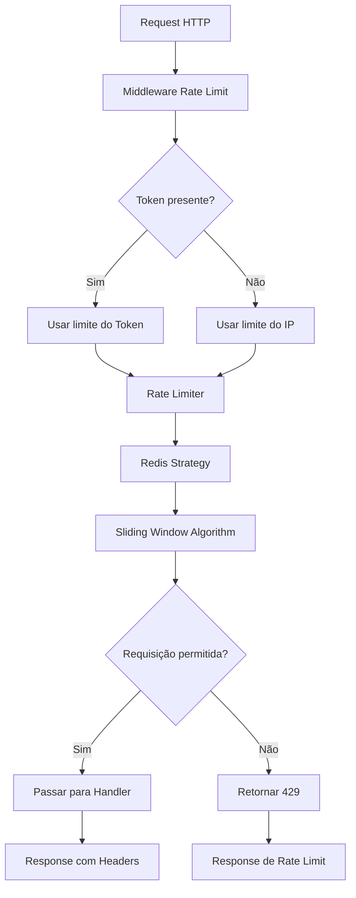

# 🚦 Rate Limiter Go

> Sistema de rate limiting em Go com Redis e algoritmo Sliding Window

## 📌 Sobre

Este projeto implementa um rate limiter robusto em Go que utiliza Redis como storage e o algoritmo Sliding Window para controle preciso de requisições. O sistema suporta limitação tanto por endereço IP quanto por token de acesso, com priorização de token sobre IP.

## 🔧 Como Funciona

### Fluxo de Execução



### Algoritmo Sliding Window

O sistema utiliza o algoritmo Sliding Window implementado com Redis Sorted Sets:

1. **Adiciona timestamp atual** como score no sorted set
2. **Remove timestamps antigos** (fora da janela deslizante)
3. **Conta requisições** no intervalo atual
4. **Verifica se está dentro do limite** configurado
5. **Define TTL** para limpeza automática

### Priorização Token > IP

- Se um token válido estiver presente no header `API_KEY`, usa as configurações do token
- Se não houver token ou token inválido, usa as configurações do IP
- Tokens têm configurações independentes definidas em `configs/tokens.json`

## 🚀 Execução

### Pré-requisitos

- Docker e Docker Compose
- Go 1.23.5+ (apenas para desenvolvimento)

### Comandos Disponíveis

```bash
# Ver todos os comandos
make help

# Subir ambiente completo (Redis + App)
make docker-up

# Ver logs da aplicação
make docker-logs

# Executar todos os testes
make test

# Executar testes de carga
make test-load

# Derrubar ambiente
make docker-down

# Limpar volumes e containers
make clean
```

### Execução Rápida

```bash
# 1. Subir ambiente
make docker-up

# 2. Testar endpoints
curl http://localhost:8080/health
curl http://localhost:8080/api/v1/resource

# 3. Testar rate limiting
for i in {1..15}; do curl http://localhost:8080/api/v1/resource; done

# 4. Testar com token
curl -H "API_KEY: std_1234567890" http://localhost:8080/api/v1/resource
```

## ⚙️ Configuração

### Variáveis de Ambiente (.env)

```env
# Rate Limiter Configuration
RATE_LIMIT_IP=10
RATE_LIMIT_WINDOW_SECONDS=1
RATE_LIMIT_BLOCK_DURATION_SECONDS=300

# Redis Configuration
REDIS_HOST=localhost
REDIS_PORT=6379
REDIS_PASSWORD=
REDIS_DB=0

# Server Configuration
SERVER_PORT=8080
APP_ENV=development
```

### Configuração de Tokens (configs/tokens.json)

```json
{
  "std_1234567890": {
    "limit": 100,
    "window_seconds": 1,
    "block_duration_seconds": 300
  },
  "std_1234567891": {
    "limit": 50,
    "window_seconds": 1,
    "block_duration_seconds": 600
  },
  "pro_1234567892": {
    "limit": 1000,
    "window_seconds": 1,
    "block_duration_seconds": 60
  }
}
```

## 📚 API

### Endpoints

#### GET /health
Health check do serviço (sem rate limiting)

**Response:**
```json
{
  "message": "Service is healthy",
  "data": {
    "status": "ok",
    "timestamp": "2024-01-15T10:30:00Z",
    "service": "rate-limiter"
  },
  "timestamp": "2024-01-15T10:30:00Z"
}
```

#### GET /api/v1/resource
Recurso de exemplo com rate limiting aplicado

**Headers de Rate Limit:**
- `X-RateLimit-Limit`: Limite de requisições por janela
- `X-RateLimit-Remaining`: Requisições restantes na janela atual
- `X-RateLimit-Reset`: Timestamp de reset da janela

**Response (200):**
```json
{
  "message": "Resource accessed successfully",
  "data": {
    "resource": "sample-resource",
    "timestamp": "2024-01-15T10:30:00Z",
    "message": "This is a sample resource for testing rate limiting"
  },
  "timestamp": "2024-01-15T10:30:00Z"
}
```

**Response (429 - Rate Limited):**
```json
{
  "error": "Too Many Requests",
  "message": "you have reached the maximum number of requests or actions allowed within a certain time frame",
  "timestamp": "2024-01-15T10:30:00Z"
}
```

### Swagger UI

Documentação interativa disponível em: http://localhost:8080/swagger

## 🧪 Testes

### Testes Unitários
```bash
go test ./tests/unit/...
```

**Cobertura:**
- Lógica do rate limiter com mock strategy
- Middleware HTTP
- Configurações e validações
- Priorização Token > IP

### Testes de Integração
```bash
go test ./tests/integration/...
```

**Cobertura:**
- Redis real com testcontainers
- Sliding Window algorithm
- Block duration
- Múltiplos cenários de limite

### Testes de Carga

Os testes de carga validam o comportamento do sistema sob **diferentes condições de alto tráfego**, conforme requisito do desafio:

```bash
# Executar todos os testes de carga
go test ./tests/load/... -v

# Executar teste específico
go test ./tests/load/... -v -run TestLoadHighTrafficBurst
```

#### Cenários de Teste de Carga

| Teste | Descrição | Objetivo |
|-------|-----------|----------|
| `TestLoadIPRateLimit` | Limite básico por IP | Valida bloqueio básico (15 req/s) |
| `TestLoadTokenRateLimit` | Limite básico por Token | Valida bloqueio com token (25 req/s) |
| `TestLoadConcurrentUsers` | Múltiplos usuários | Valida isolamento entre IPs |
| `TestLoadHighTrafficBurst` | **Burst de tráfego** | 100 req/s por 5s - valida picos |
| `TestLoadSustainedHighTraffic` | **Tráfego sustentado** | 30 req/s por 10s - valida estabilidade |
| `TestLoadMassiveConcurrency` | **Concorrência massiva** | 50 usuários simultâneos - valida escalabilidade |
| `TestLoadRecoveryAfterBlock` | **Recuperação pós-bloqueio** | Valida desbloqueio após expiração |
| `TestLoadSpikeTraffic` | **Picos alternados** | Tráfego normal + picos - valida resiliência |

#### Métricas Coletadas

Cada teste de carga fornece métricas detalhadas:

- **Total de requisições**: Quantidade total enviada
- **Requisições bem-sucedidas**: HTTP 200
- **Requisições bloqueadas**: HTTP 429
- **Taxa de sucesso**: Percentual de sucesso
- **Latência média**: Tempo médio de resposta
- **Latência p50/p95/p99**: Percentis de latência
- **Throughput**: Requisições por segundo

#### Exemplo de Saída

```
=== Teste de Burst (100 req/s por 5s) ===
  Total de requisições: 500
  Requisições bem-sucedidas: 250
  Requisições bloqueadas (429): 250
  Taxa de sucesso: 50.00%
  Latência média: 2.5ms
  Latência p50: 2ms
  Latência p95: 5ms
  Latência p99: 8ms
  Latência máxima: 15ms
```

### Exemplo de Teste Manual com Vegeta

```bash
# Teste de limite por IP (10 req/s)
echo "GET http://localhost:8080/api/v1/resource" | vegeta attack -rate=15 -duration=5s | vegeta report

# Teste de limite por Token (100 req/s)
echo "GET http://localhost:8080/api/v1/resource" | vegeta attack -rate=120 -duration=5s -header="API_KEY: std_1234567890" | vegeta report

# Teste de burst extremo
echo "GET http://localhost:8080/api/v1/resource" | vegeta attack -rate=1000 -duration=10s | vegeta report
```

## 📝 Documentação

- [ADRs (Architecture Decision Records)](./docs/adr/)
- [Testes de Carga - Guia Completo](./docs/load-testing.md)
- [Swagger UI](http://localhost:8080/swagger)
- [Exemplos de Requisições](./api/requests.http)

## 🏗️ Arquitetura

### Estrutura do Projeto

```
/
├── cmd/server/           # Entry point da aplicação
├── internal/
│   ├── config/          # Carregamento de configurações
│   ├── limiter/         # Lógica do rate limiter
│   ├── middleware/       # Middleware HTTP
│   └── handler/         # Handlers HTTP
├── pkg/response/        # Padronização de respostas
├── tests/               # Testes (unit, integration, load)
├── docs/                # Documentação
├── configs/             # Configurações (tokens.json)
└── api/                 # Exemplos de requisições
```

### Strategy Pattern

O sistema utiliza o Strategy Pattern para permitir troca fácil do storage:

```go
type StorageStrategy interface {
    Allow(ctx, key, limit, window) (bool, int, time.Time, error)
    Reset(ctx, key) error
    Close() error
}
```

Atualmente implementado:
- `RedisStrategy`: Usa Redis com Sorted Sets para Sliding Window

## 🔍 Monitoramento

### Headers de Rate Limit

Cada resposta inclui headers informativos:

- `X-RateLimit-Limit`: Limite de requisições por janela
- `X-RateLimit-Remaining`: Requisições restantes na janela atual  
- `X-RateLimit-Reset`: Timestamp de reset da janela

### Logs

O sistema gera logs estruturados para monitoramento:

```json
{
  "level": "info",
  "msg": "Request processed",
  "ip": "192.168.1.1",
  "token": "std_1234567890",
  "allowed": true,
  "remaining": 5,
  "timestamp": "2024-01-15T10:30:00Z"
}
```

## 🚀 Performance

### Benchmarks

- **Latência média**: < 1ms para verificação de rate limit
- **Throughput**: > 10.000 req/s com Redis local
- **Memória**: ~1KB por IP/Token ativo
- **Precisão**: 100% com Sliding Window

### Otimizações

- Pipeline Redis para operações atômicas
- TTL automático para limpeza de dados
- Sorted Sets para contagem eficiente
- Context timeout para evitar travamentos

## 🤝 Contribuição

1. Fork o projeto
2. Crie uma branch para sua feature
3. Commit suas mudanças
4. Push para a branch
5. Abra um Pull Request

## 📄 Licença

Este projeto está sob a licença MIT. Veja o arquivo [LICENSE](LICENSE) para detalhes.
