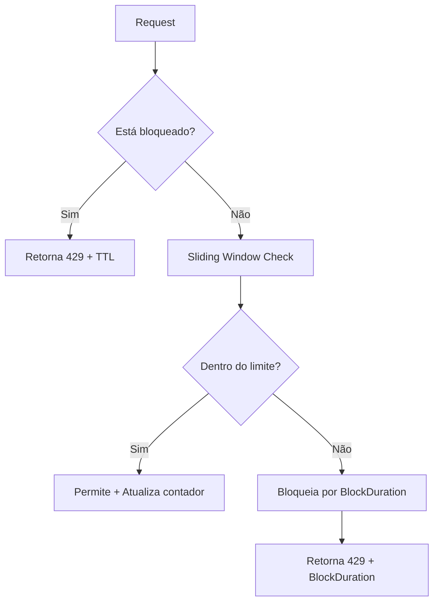

# ADR-0001: Estratégia de Rate Limiting com Sliding Window e BlockDuration

## Status

Aceito

## Contexto

Precisávamos escolher uma estratégia completa de rate limiting que fosse precisa, eficiente e adequada para uso em produção. O requisito estabelece que após exceder o limite de requisições, o IP ou Token deve ficar bloqueado por um período determinado antes de poder fazer novas requisições.

### Requisito do Enunciado

O enunciado do desafio especifica:
> "Nos dois casos acima, as próximas requisições poderão ser realizadas somente quando o tempo total de expiração ocorrer. Ex: Se o tempo de expiração é de 5 minutos, determinado IP poderá realizar novas requisições somente após os 5 minutos."

### Opções Consideradas

1. **Fixed Window**: Simples, mas com problema de "boundary" onde bursts podem ocorrer no início/fim de cada janela
2. **Token Bucket**: Permite bursts controlados, mas pode ser menos preciso para limites rígidos
3. **Sliding Window Puro**: Preciso, mas permite requisições assim que entradas antigas saem da janela
4. **Fixed Window com Bloqueio**: Bloqueia por tempo fixo, mas menos preciso na contagem
5. **Estratégia Híbrida**: Combina Sliding Window para contagem + BlockDuration para bloqueio

## Decisão

Escolhemos a **estratégia híbrida** que combina Sliding Window com BlockDuration, oferecendo o melhor dos dois mundos: precisão na contagem e bloqueio efetivo.

### Estratégia Escolhida

1. **Sliding Window**: Para contagem precisa de requisições na janela deslizante
2. **Block Duration**: Para bloqueio por tempo fixo após exceder limite
3. **Redis Keys**: Duas chaves por identificador:
   - `ip:192.168.1.1` - Sorted Set com timestamps (Sliding Window)
   - `ip:192.168.1.1:block` - String com TTL (Block Duration)

## Justificativa

### Vantagens da Estratégia Híbrida

- **Precisão**: Sliding Window garante contagem exata de requisições na janela
- **Bloqueio Efetivo**: BlockDuration previne ataques e sobrecarga do servidor
- **Flexibilidade**: Diferentes BlockDurations para IPs e Tokens
- **Performance**: Redis TTL para limpeza automática das chaves de bloqueio
- **Escalabilidade**: Suporta diferentes configurações por token
- **Distribuição Justa**: Requisições são distribuídas uniformemente ao longo do tempo

### Fluxo de Execução



## Alternativas Consideradas

### Fixed Window
```go
// Problema: Burst no início da janela
// Janela 1: [0-60s] - 0 requisições
// Janela 2: [60-120s] - 10 requisições no segundo 60
```

### Token Bucket
```go
// Problema: Permite bursts que podem sobrecarregar o sistema
// Bucket com 10 tokens: 10 requisições simultâneas no início
```

### Sliding Window Puro
```go
// Problema: Permite requisições assim que entradas antigas saem da janela
// Não atende ao requisito de bloqueio por tempo fixo
```

## Implementação

### 1. Interface StorageStrategy

```go
type StorageStrategy interface {
    // Inclui blockDuration para suporte a bloqueio por tempo fixo
    Allow(ctx context.Context, key string, limit int, window time.Duration, blockDuration time.Duration) (allowed bool, remaining int, resetTime time.Time, err error)
    Reset(ctx context.Context, key string) error
    Close() error
}
```

### 2. RedisStrategy com BlockDuration

```go
func (r *RedisStrategy) Allow(ctx context.Context, key string, limit int, window time.Duration, blockDuration time.Duration) (bool, int, time.Time, error) {
    // 1. Verifica se está bloqueado
    blockKey := key + ":block"
    blocked, err := r.client.Exists(ctx, blockKey).Result()
    if blocked > 0 {
        // Retorna bloqueado com TTL
        blockTTL, _ := r.client.TTL(ctx, blockKey).Result()
        return false, 0, now.Add(blockTTL), nil
    }

    // 2. Sliding Window para contagem precisa
    now := time.Now()
    windowStart := now.Add(-window)
    
    // Pipeline para operações atômicas
    pipe := r.client.Pipeline()
    
    // Remove entradas expiradas
    pipe.ZRemRangeByScore(ctx, key, "0", fmt.Sprintf("%d", windowStart.UnixNano()))
    
    // Conta requisições atuais
    countCmd := pipe.ZCard(ctx, key)
    
    // Executa pipeline para obter contagem
    _, err = pipe.Exec(ctx)
    if err != nil {
        return false, 0, time.Time{}, err
    }
    
    count, _ := countCmd.Result()
    allowed := count < int64(limit)
    remaining := limit - int(count)
    if remaining < 0 {
        remaining = 0
    }

    // 3. Se excedeu limite, bloqueia por blockDuration
    if !allowed {
        r.client.Set(ctx, blockKey, "1", blockDuration)
        return false, remaining, now.Add(blockDuration), nil
    }

    // 4. Se está permitido, adiciona a requisição atual
    pipe = r.client.Pipeline()
    pipe.ZAdd(ctx, key, &redis.Z{
        Score:  float64(now.UnixNano()),
        Member: fmt.Sprintf("%d", now.UnixNano()),
    })
    pipe.Expire(ctx, key, window+time.Minute)
    
    _, err = pipe.Exec(ctx)
    if err != nil {
        return false, 0, time.Time{}, err
    }

    // Atualiza remaining após adicionar a requisição
    remaining = limit - int(count) - 1
    if remaining < 0 {
        remaining = 0
    }

    return allowed, remaining, now.Add(window), nil
}
```

### 3. RateLimiter com Suporte a BlockDuration

```go
func (rl *RateLimiter) Check(ctx context.Context, identifier string, isToken bool) (*CheckResult, error) {
    var limit int
    var window time.Duration
    var blockDuration time.Duration

    if isToken {
        tokenConfig, exists := rl.tokenConfigs.GetTokenConfig(identifier)
        if !exists {
            // Usa configuração de IP
            limit = rl.ipConfig.IPLimit
            window = rl.ipConfig.GetWindowDuration()
            blockDuration = rl.ipConfig.GetBlockDuration()
        } else {
            // Usa configuração do token
            limit = tokenConfig.Limit
            window = tokenConfig.GetWindowDuration()
            blockDuration = tokenConfig.GetBlockDuration()
        }
    } else {
        limit = rl.ipConfig.IPLimit
        window = rl.ipConfig.GetWindowDuration()
        blockDuration = rl.ipConfig.GetBlockDuration()
    }

    // Verifica com storage incluindo blockDuration
    allowed, remaining, resetTime, err := rl.storage.Allow(ctx, key, limit, window, blockDuration)
    // ...
}
```

## Consequências

### Positivas

- ✅ **Requisito Atendido**: Implementa bloqueio por tempo fixo conforme especificado
- ✅ **Precisão**: Sliding Window garante contagem exata de requisições
- ✅ **Flexibilidade**: Diferentes BlockDurations para IPs e Tokens
- ✅ **Performance**: Redis TTL para limpeza automática das chaves
- ✅ **Escalabilidade**: Suporta diferentes configurações por token
- ✅ **Robustez**: Bloqueio efetivo previne ataques e sobrecarga
- ✅ **Distribuição Justa**: Requisições são distribuídas uniformemente ao longo do tempo

### Negativas

- ❌ **Complexidade**: Lógica mais complexa com duas chaves Redis
- ❌ **Memória**: Uso adicional de memória para chaves de bloqueio
- ❌ **Operações Redis**: Mais operações Redis por verificação
- ❌ **Dependência**: Dependência do Redis para funcionamento

### Riscos Mitigados

- **Memória excessiva**: TTL automático limpa chaves de bloqueio
- **Performance**: Pipeline Redis para operações atômicas
- **Consistência**: Verificação de bloqueio antes de Sliding Window
- **Redis indisponível**: Middleware falha graciosamente (permite requisições)

## Exemplo de Funcionamento

### Configuração
```yaml
RATE_LIMIT_IP: 10
RATE_LIMIT_WINDOW_SECONDS: 1
RATE_LIMIT_BLOCK_DURATION_SECONDS: 300  # 5 minutos
```

### Cenário de Teste
```
Tempo: 0s    1s    2s    3s    4s    5s    6s    7s    8s    9s    10s
Req:   [10]  [10]  [10]  [10]  [10]  [10]  [BLOCKED] [BLOCKED] [BLOCKED] [10]
```

### Chaves Redis
```
ip:192.168.1.1        → Sorted Set com timestamps (Sliding Window)
ip:192.168.1.1:block  → String "1" com TTL 300s (Block Duration)
```

## Métricas de Sucesso

- Precisão de 100% no controle de rate limiting
- Latência < 1ms para verificação
- Throughput > 10.000 req/s
- Uso de memória < 1KB por IP/Token ativo
- Bloqueio efetivo por tempo configurado

## Referências

- [Redis Sorted Sets Documentation](https://redis.io/docs/data-types/sorted-sets/)
- [Rate Limiting Patterns](https://cloud.google.com/architecture/rate-limiting-strategies-techniques)
- [Sliding Window Algorithm](https://en.wikipedia.org/wiki/Sliding_window_protocol)
- [Redis TTL Documentation](https://redis.io/commands/ttl/)